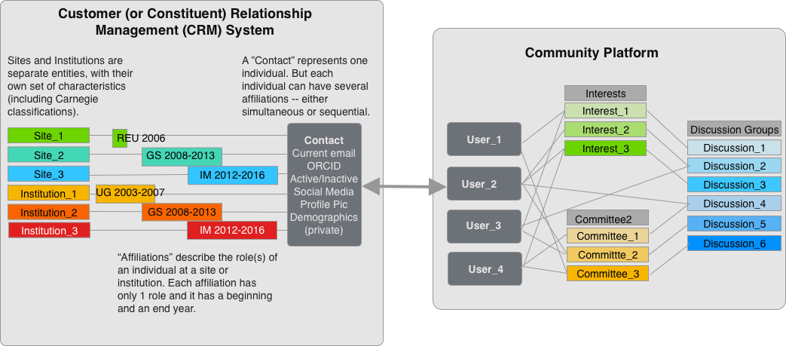

# Site Personnel Lists 

## Overview
It's helpful to have an overview of how the community platform works before detailing the process of adding new people. There are two major components to the SalesForce installation behind the community platform:
* The Client (or Customer or Constituent) Relationship Management System (CRM) is basically just a relational database that is structured to hold the kind of data that organizations usually need about the people who participate in them. New participants have to be added to the CRM before anything else can happen and licenses to the CRM are expensive (therefore limited to the LNO). 
* The community platform houses the interactions between people ("users") and groups within the Network. Customer User licenses allow individuals to login, easily update their own information, join and leave groups, post updates, and ask questions.  The thing that ties these two components together is a relationship between a single "contact" (created by the Network Office) and the related "user" (created by the Network Office when a person is added and updated by the individual).

Rather than having an individual simply associated with a site or not, the new system maintains a record of prior associations and allows multiple simultaneous associations (with different sites, in different roles, and with different institutions). This is valuable for understanding how individuals interact with the Network across their careers. To accomplish it, however, we need to update **affiliations**, rather than just sites.

## Making individual updates

Sometimes, it's important to add an individual to your site right away. To add key personnel to your site between major updates, login to LTERHub and [create a case](https://lternetwork.force.com/lterhub/s/contactsupport) with their name, role, and email address. The LNO will create a contact and a user for them and trigger a message to login and fill in other key information.

Once a user is created and they have logged in, they are able to update their own information, including email (which automatically updates the login email), site and institutional affiliations, ORCID, social media accounts and research interests. They can also join discussion groups and update committee memberships.

## Making bulk updates

Usually, there are a few times a year when many people need to be added at once. In those situations, create an excel or csv file with the following headers that contains all the individuals that are (to the best of your knowledge) new to LTER or that need to be updated. Often, individuals who are new to your site actually have a prior LTER identity. When they are using the same email address, these duplicates will be caught on creation. If they are using a new email address, the LNO will eventually find and resolve them -- but it takes some extra work.

Upload the file as an attachment to [a case in the LTERhub](https://lternetwork.force.com/lterhub/s/contactsupport) using the case reason "new participant."

|Site|First Name|Middle Name|Last Name|email address|Status\* |Site_Role_1\*\* |Role_1-Start(if known)|Role_1_end|Site_Role_2|Role_2_start|Role_2_end|
|---|---|---|---|---|---|---|---|---|---|---|
|ABC|Jane|Q|Ecologist|jecologist@institution.edu|Current|Graduate Student|2021|n/a||||
|DEF|Joe|F|Biogeochemist|jbiogeochemist@institution.edu|Current|Information Manager|2010|n/a|Investigator|2021|n/a|
|XYZ|James|J|Silverback|jjsilverback@agency.gov|Former|Investigator|1980|1990|Retired|1990|1999|
|JKL|Mary|Q|Whosits|mqwhosits@institution.edu|Former|Unknown|||||

At the time they are added, each new participant will receive an automatic email from LTERHub with a welcome message and a link to set their password and update their profile with additional information such as their ORCID, institutional affiliations, a biographical statement, social media information, a photograph or avatar -- and demographic information. 

\* *"Status" has 2 options: "Current" or "Former." This reflects an individual's affiliation with the site. All newly affiliated individuals should be listed as "Current." When an individual leaves your site, they should be identified as "Former" for your site and an end date entered for their role. When their status changes to "Former" at all sites with which they had an affiliation, their LTER status will automatically change to "Inactive". As long as they maintain an active affiliation with any LTER site, their LTER status will be "Active."*

\** *Options for "Role" are detailed below.*

**The table above illustrates four common cases:**

* **New participants:** The only information required is Site, First Name, Middle Name, Last Name, Email address, Status, Role. For additional clarity, include the start date (especially if different from the crrent year). The remaining columns should have n/a's.  

* **Adding roles:** LTERHub is designed to accommodate multiple simultaneous roles and site affiliations. When an individual adds a new role at your site and keeps the old role (e.g. an Information Manager becomes a co-PI and retains the Information Manager role) add the new role in the <Role_2> column; add the year the new role started in <Role_2_start> column; and enter n/a in the \<Role_1_end\> and \<Role_2_end\> columns. If you know what year the person started role 1, add it. But incorrect information is worse than no information. Ideally, the individual will update this information themselves.

* **Changing or ending roles:** If someone's role has changed (e.g. a graduate student becomes a postdoc), add the postdoc role and the year it started in \<Role_2\> and \<Role_2_start\> respectively. Add the graduate student start- and end-years in the \<Role_1_start\> and \<Role_1_end\> column. Enter n/a in the <Role_2_end> column to indicate that the role is ongoing.

* **Former participants:** Only current participants should be displaying in the [LTER directory](https://lternetwork.force.com/lterhub/s/directory). If individuals are showing up that are no longer affiliated with your site, it's because the LNO has no information to indicate that they are no longer actively associated with your site. In these cases, include them in your table with "Former" in the \<Status\> column. If you know what role they held, please include it. If you have made a reasonable attempt to find out what role they held, but cannot, use "Unknown" in the \<Site_Role_1\> column to indicate that the information is not available.

## Detailed Field descriptions and options 

### Field Name Definition Options

A few fields use limited options and will not accept any text other than the below.

* Site options: AND, ARC, BES, BLE, BNZ, CAP, CCE, CDR, CWT, FCE, GCE, HBR, HFR, JRN, KBS, KNZ, LUQ, MCM, MCR, MSP, NES, NGA, NTL, NWT, PAL, PIE, SBC, SEV, SGS, VCR

    * Special Options: EDI, LNO, INT, NWK are for personnel associated with the Environmental Data Initiative (EDI), Network Office (LNO), International LTER (INT), LTER Network Office (LNO), and the Network as a whole (NWK)--for example, staff of related organizations and networks. 

* Site Role:
    * **Lead Principal Investigator:** The primary individual who is responsible for the scientific or technical direction of the project.
    * **Co-Principal Investigator:** The individuals who are formally responsible for the scientific or technical direction of the project. (Cover page investigators.) 
    * **Investigator:** An individual with substantial scientific involvement in the LTER, but who is not a Co-Principal Investigator(s). LTER Investigators need not funded by the project.
    * **Postdoctoral Associate:** An individual with a doctoral-level degree who does research at the site, but does not hold a permanent position. Generally Postdocs are less than 5 years post-degree.
    * **Graduate Student:** A part-time or full-time student working on the project in a research capacity who holds at least a bachelor's degree and is enrolled in a degree program leading to an advanced degree.  
    * **Undergraduate Student:** A student working on the project in a research capacity who is enrolled in a degree program (part-time or full-time) leading to a bachelor's or associate's degree. 
    * **Information Manager:** A person at an LTER site that spends some or all of their time in the process of data and information management. This person may or may not be the site representative to the data management committee.
    * **Education Manager:** A person at an LTER site that spends some or all of their time in the process of education/outreach. This person may or may not be the site representative to the education/outreach committee.  
    * **Other Professional:** A person who may or may not hold a doctoral degree or its equivalent, who is considered a professional and is not reported as a Principal Investigator, Co-principal Investigator, Investigator, Postdoctoral Associate or Student. Examples include research associates, physicians, veterinarians, system experts, computer programmers and design engineers.
    * **Technical/Research Staff:** Technicians and field research personnel. 
    * **Administrative Staff:** Persons working on the project in a non-research capacity. 
    * **Other Staff:** Persons working on the project in a non-research capacity, such as draftsmen, animal caretakers, electricians and custodial personnel. 
    * **Interested Party:** A person who is associated with an LTER site or the Network through interest, educational programs, public outreach etc., may include educational or community partners, neighbors, board members, etc. 
    * **Retired:** _Emeritus_ Investigators who maintain an active interest in the site and the Network. Not the same as past network members (who are designated as "Former"). 

* Less-frequently used options, for individuals that you want to associate with your site:
    * K-12 Teacher
    * Volunteer
    * Media

 
